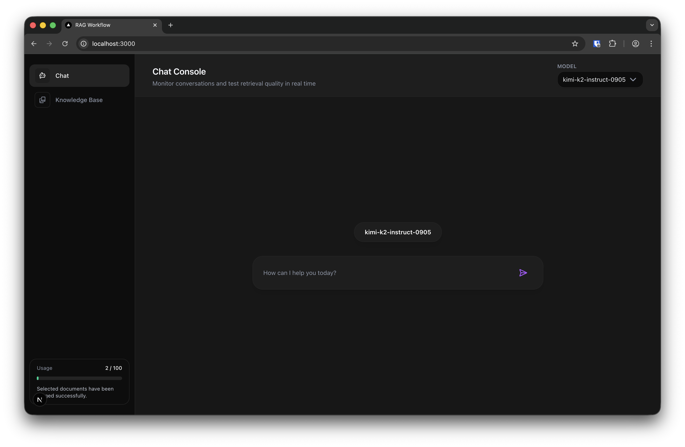

# RAG Workflow

## Overview

This project implements a Retrieval-Augmented Generation (RAG) workflow for building AI-powered question-answering systems. The application combines LangGraph for workflow orchestration, Qdrant for vector storage, and various LLM providers for embeddings and generation.



## Architecture

The application follows a modular architecture with the following components:

1. **Frontend**: Next.js control-room interface (`frontend/`) for live chat supervision
2. **Backend**: FastAPI server exposing REST endpoints
3. **Workflow Engine**: LangGraph-powered RAG pipeline with multiple stages
4. **Vector Store**: Qdrant for efficient similarity search
5. **AI Models**:
   - Dense Embeddings: intfloat/multilingual-e5-large-instruct via Together AI
   - Sparse Embeddings: Qdrant/bm25
   - Generation: moonshotai/Kimi-K2-Instruct-0905 via Together AI
   - Re-ranking: jina-reranker-v1-tiny-en via Jina AI (optional)

## Prerequisites

- Python 3.12+
- [uv](https://github.com/astral-sh/uv) for dependency management
- Docker and Docker Compose (for Qdrant vector database)
- API keys for Together AI, Qdrant and optionally Jina AI

## Quickstart

1. **Install dependencies**

   ```bash
   uv sync
   uv pip install -e .
   ```

2. **Configure environment**

   ```bash
   cp .env.example .env
   ```

   Fill in the placeholders with your credentials. Key variables:
   - `BACKEND_URL` (default `http://localhost:8000`)
   - `QDRANT_URL` / `QDRANT_API_KEY`, plus optional overrides such as `QDRANT_COLLECTION_NAME` (`sutd`) and `QDRANT_SEARCH_TOP_K` (`10`)
   - `LLM_API_KEY` with optional `LLM_BASE_URL` / `LLM_MODEL` (default `moonshotai/Kimi-K2-Instruct-0905`)
   - `EMBEDDINGS_API_KEY` with optional `EMBEDDINGS_BASE_URL`, `EMBEDDINGS_MODEL` (default `intfloat/multilingual-e5-large-instruct`), and `EMBEDDINGS_DIM` (`1024`)
   - `ENABLE_RERANKER` (`false` by default) plus `RERANKING_API_KEY` when enabling the Jina reranker

   Review `src/app/core/config.py` if you need to adjust defaults beyond these variables.

3. **Ingest data**

   Use the control-room UI or the `/ingest/web` and `/ingest/pdf` endpoints documented below to add sources. Upload PDFs directly from the Knowledge Base tab or call the APIs with curl/Postman.

4. **Run services**

   ```bash
   docker compose up -d
   uv run fastapi run src/app/api.py
   ```

   In a separate terminal, start the frontend:

   ```bash
   cd frontend
   pnpm install
   pnpm dev
   ```

   The FastAPI server listens on `http://localhost:8000`. The Next.js app proxies requests to `/query`; export `NEXT_PUBLIC_RAG_API` if the backend runs elsewhere.

## Ingestion Pipeline

Regardless of entry point (UI or API), ingestion flows through the same stages:

- **Load sources**: Scrapes URLs or extracts text from uploaded PDFs.
- **Chunk documents**: Splits text using recursive chunking with configurable size/overlap.
- **Generate embeddings**: Creates dense vectors with `intfloat/multilingual-e5-large-instruct` and sparse BM25 vectors.
- **Store in Qdrant**: Persists chunks, embeddings, and metadata.

## Usage

1. With FastAPI and the Next.js dev server running, open:
   - Control Room UI: <http://localhost:3000>
   - FastAPI docs: <http://localhost:8000/docs>

2. In the Control Room chat, issue questions against your knowledge base. The UI forwards each prompt to `/query` and renders the grounded answer.

3. The system will:
   - Analyze your query
   - Retrieve relevant documents from the vector store
   - Optionally re-rank results for better quality
   - Generate a response based on the retrieved context

### API Access

You can also interact with the RAG system programmatically via its API:

- `POST /query` — Submit a question to the RAG system.

  ```bash
  curl -X POST "http://localhost:8000/query" \
       -H "Content-Type: application/json" \
       -d '{"query": "Your question here"}'
  ```

- `POST /ingest/web` — Provide a JSON body with `urls` to crawl and index web pages.

  ```bash
  curl -X POST "http://localhost:8000/ingest/web" \
       -H "Content-Type: application/json" \
       -d '{"urls": ["https://example.com/docs"]}'
  ```

- `POST /ingest/pdf` — Upload one or more PDF files for ingestion.

  ```bash
  curl -X POST "http://localhost:8000/ingest/pdf" \
       -F "files=@manual.pdf"
  ```

- `GET /health` — Health check endpoint (includes the active Qdrant collection name).

## Project Structure

```md
rag-workflow/
├── src/
│   ├── app/
│   │   ├── api.py              # FastAPI server
│   │   ├── core/               # Configuration
│   │   ├── db/                 # Database integration (Qdrant)
│   │   ├── ingestion/          # Data ingestion utilities
│   │   │   ├── ingest.py       # Core ingestion functions
│   │   │   ├── web_loader/     # Web document loading utilities
│   │   │   └── pdf_loader/     # PDF document loading utilities
│   │   ├── models/             # Data models
│   │   ├── utils/              # Utility functions
│   │   └── workflow/           # RAG workflow implementation
├── frontend/                   # Next.js control-room frontend
├── assets/                     # Images and documentation assets
├── notebooks/                  # Jupyter notebooks
│   ├── ingest_data.ipynb       # Jupyter notebook for data ingestion
│   └── ragas_eval.ipynb        # RAGAS-based evaluation walkthrough
├── .env.example                # Environment variable template
├── docker-compose.yaml         # Qdrant service configuration
├── pyproject.toml              # Project dependencies
└── README.md                   # This file
```

## Features

- **LangGraph RAG pipeline** that fuses retrieval and generation for grounded responses.
- **Next.js control room + FastAPI API** for conversational oversight and programmatic access to the same workflow.
- **Hybrid search** combining `intfloat/multilingual-e5-large-instruct` dense vectors with Qdrant BM25 sparse vectors via Reciprocal Rank Fusion (`src/app/db/vector_db.py`).
- **Environment-driven configuration** covering models, retrieval parameters, and the optional Jina reranker switch.
- **Flexible ingestion CLI** for URLs/PDFs with chunk controls and caching to avoid reprocessing.

## Evaluation

The `notebooks/ragas_eval.ipynb` notebook walks through running RAGAS evaluations against recorded question/answer pairs (see `notebooks/evaluation_records.json`). Use it to track retrieval and generation quality as you iterate on the workflow.

## License

This project is licensed under the MIT License - see the [LICENSE](LICENSE) file for details.
